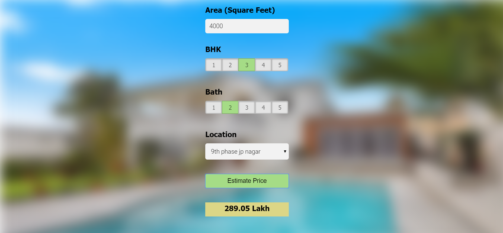

                                                Banglore Home Price Prediction
This data science project uses sklearn and linear regression to build a house price prediction model using banglore home prices dataset from kaggle.com. 
It includes python flask server that uses the saved model to serve http requests. 
Lastly I have built a website in html, css and javascript that allows user to enter home square ft area, bedrooms ,baths and location and it will call python flask server to retrieve the predicted price.

Technology and tools wise this project covers,

1. Python    
2. Numpy and Pandas for data cleaning
3. Matplotlib for data visualization
4. Sklearn for model building
5. Jupyter notebook, visual studio code and pycharm as IDE
6. Python flask for http server
7. HTML/CSS/Javascript for UI
